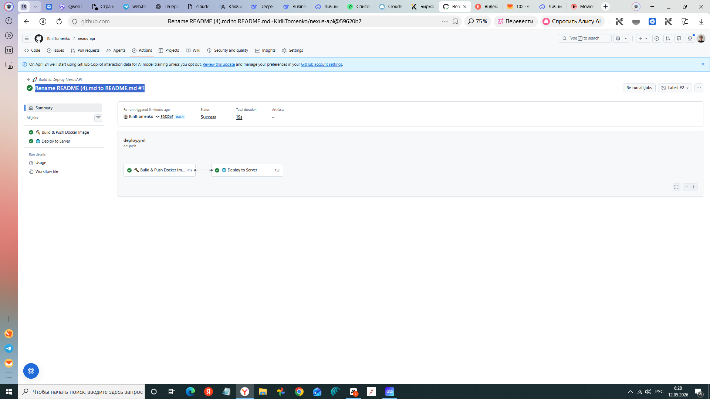
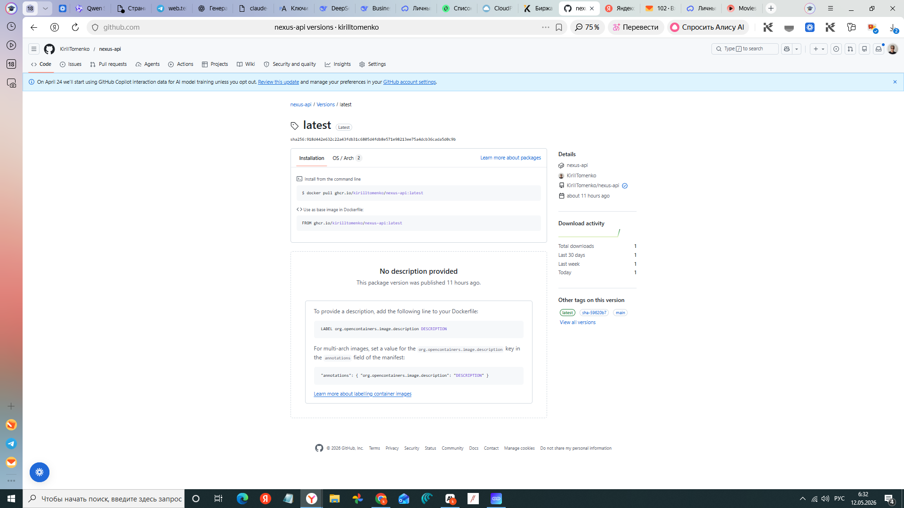
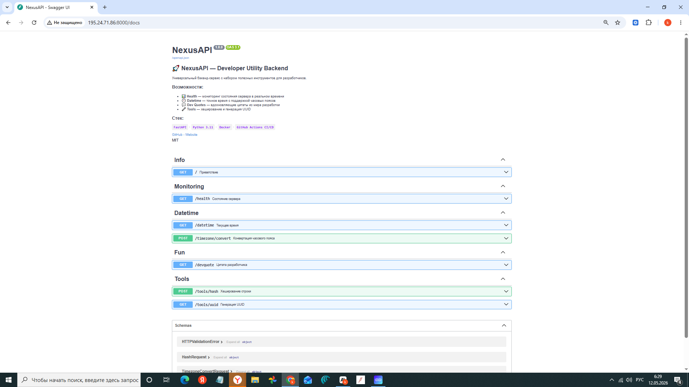
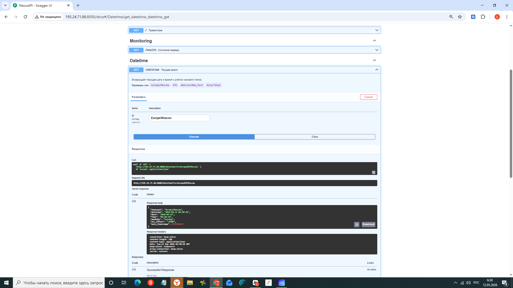
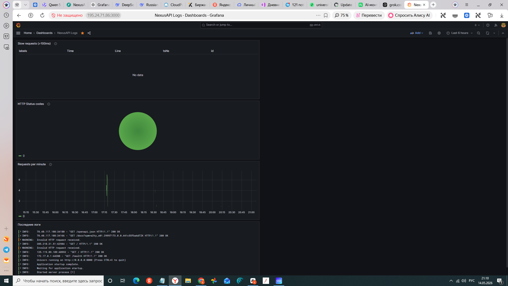

# 🚀 NexusAPI

> Портфельный REST API-сервис на FastAPI с полным CI/CD-пайплайном через GitHub Actions.

[](https://github.com/KirillTomenko/nexus-api/actions/workflows/deploy.yml)


---

## 🛠️ Стек

| Слой | Технология |
|---|---|
| Фреймворк | FastAPI |
| Сервер | Uvicorn |
| Контейнер | Docker |
| CI/CD | GitHub Actions |
| Реестр | GitHub Container Registry (ghcr.io) |

---

## 📡 Эндпоинты

| Метод | URL | Описание |
|---|---|---|
| GET | `/` | Информация о проекте |
| GET | `/health` | Метрики CPU, RAM, uptime |
| GET | `/datetime?tz=Europe/Moscow` | Текущее время по зоне |
| POST | `/timezone/convert` | Конвертация между зонами |
| GET | `/devquote` | Случайная цитата разработчика |
| POST | `/tools/hash` | Хеш строки (sha256/md5/sha512) |
| GET | `/tools/uuid?count=1` | Генерация UUID v4 |

## 📸 Screenshots

### ✅ CI/CD Pipeline — оба job'а успешны


### 📦 GitHub Container Registry — образ опубликован


### 📡 Swagger UI — документация API


### 🕐 Запрос /datetime — время по часовому поясу


### 📊 Grafana — мониторинг логов в реальном времени


## ⚡ Быстрый старт

```bash
# Клонировать
git clone https://github.com/KirillTomenko/nexus-api.git
cd nexus-api

# Установить зависимости
pip install -r requirements.txt

# Запустить
uvicorn main:app --reload
```

Открыть: http://localhost:8000/docs

### Через Docker

```bash
docker build -t nexus-api .
docker run -p 8000:8000 nexus-api
```

---

## 🔄 CI/CD-пайплайн

При каждом `push` в ветку `main` автоматически:

1. **Build** — собирается Docker-образ и публикуется в `ghcr.io`
2. **Deploy** — по SSH к серверу: скачивается новый образ → перезапускается контейнер

### Необходимые секреты (Settings → Secrets → Actions)

| Секрет | Описание |
|---|---|
| `SSH_HOST` | IP-адрес сервера |
| `SSH_USER` | Логин (обычно `root`) |
| `SSH_KEY` | Приватный SSH-ключ |
| `SSH_PORT` | Порт SSH (обычно `22`) |

## 📊 Мониторинг

Стек мониторинга разворачивается вместе с приложением через `docker-compose`:

| Сервис | URL | Описание |
|---|---|---|
| Grafana | `http://IP:3000` | Визуализация логов (admin/admin) |
| Loki | `http://IP:3100` | Хранилище логов |

### Дашборд NexusAPI Logs
- 📋 Последние логи всех запросов
- 🥧 Распределение по HTTP-статусам  
- 📈 Количество запросов в минуту
- ⚠️ Медленные запросы (>100ms)

Логи отправляются автоматически через middleware при каждом запросе к API.

## 📂 Структура проекта

```
nexus-api/
├── main.py                   # FastAPI-приложение
├── requirements.txt          # Зависимости
├── Dockerfile                # Сборка образа
├── .dockerignore
├── .gitignore
├── README.md
└── .github/
    └── workflows/
        └── deploy.yml        # CI/CD пайплайн
```

---

## 📄 Лицензия

MIT
